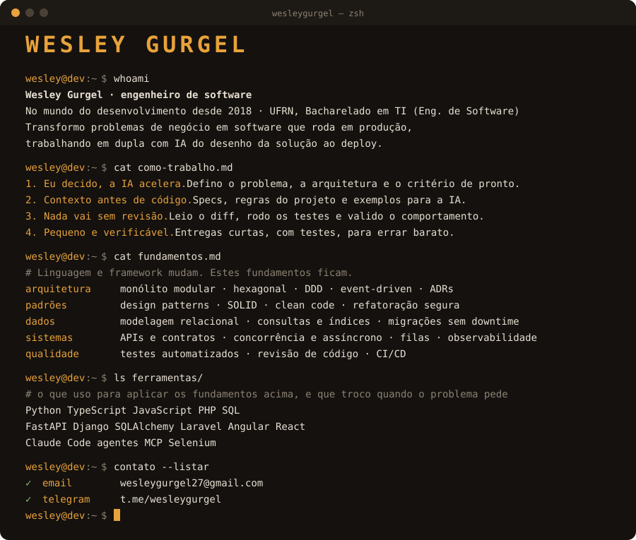

<p align="center">
  
</p>

<p align="center">
  <a href="mailto:wesleygurgel27@gmail.com"></a>
  <a href="https://t.me/wesleygurgel"></a>
</p>

<details>
<summary>Versão em texto</summary>

```bash
$ whoami
Wesley Gurgel · engenheiro de software
No mundo do desenvolvimento desde 2018 · UFRN, Bacharelado em TI (Eng. de Software)
Transformo problemas de negócio em software que roda em produção,
trabalhando em dupla com IA do desenho da solução ao deploy.

$ cat como-trabalho.md
1. Eu decido, a IA acelera. Defino o problema, a arquitetura e o critério de pronto.
2. Contexto antes de código. Specs, regras do projeto e exemplos para a IA.
3. Nada vai sem revisão. Leio o diff, rodo os testes e valido o comportamento.
4. Pequeno e verificável. Entregas curtas, com testes, para errar barato.

$ cat fundamentos.md
arquitetura  monólito modular · hexagonal · DDD · event-driven · ADRs
padrões      design patterns · SOLID · clean code · refatoração segura
dados        modelagem relacional · consultas e índices · migrações sem downtime
sistemas     APIs e contratos · concorrência e assíncrono · filas · observabilidade
qualidade    testes automatizados · revisão de código · CI/CD

$ ls ferramentas/
Python  TypeScript  JavaScript  PHP  SQL
FastAPI  Django  SQLAlchemy  Laravel  Angular  React
Claude Code  agentes  MCP  Selenium
```

</details>
